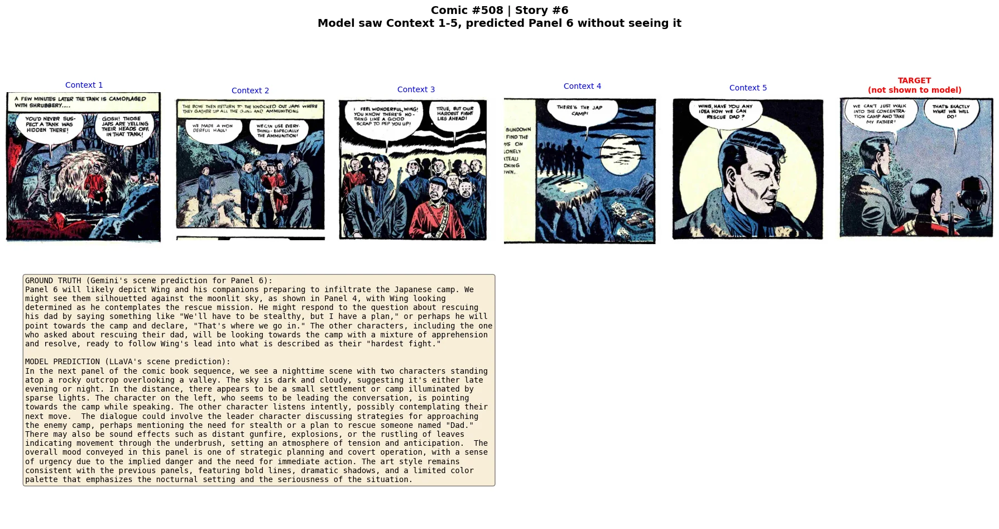
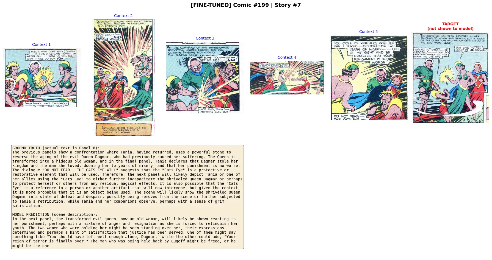
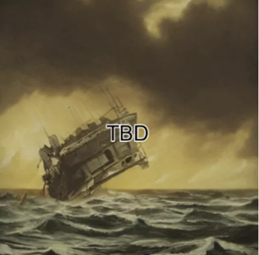
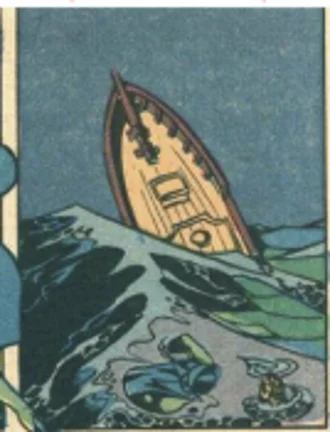

<div align="center">

# 🎨 Beyond the Frame: Multimodal AI for Comic Narrative Prediction

[](https://www.python.org/downloads/)
[](https://pytorch.org/)
[](https://huggingface.co/docs/transformers)
[](LICENSE)
[](https://ischool.illinois.edu/)

**Can AI understand what happens "between the panels" in comics?**

*A Vision-Language Model approach to modeling narrative closure in sequential comic art*

[📄 Report](docs/Project_Report.pdf) • [🚀 Quick Start](#quick-start) • [📊 Results](#-results) • [📁 Drive](https://drive.google.com/drive/u/0/folders/16-UYPPj3PAF7dpPvwn8dcFX0X9votU0t)

</div>

---

> **📂 Full Resources**: NOTE: Several files are >25 MB. Hence, For Gemini OCR extraction, intermediate data pre-processing steps, dataset images, training logs, model checkpoints, evaluation outputs, and slide deck, see the **[Google Drive](https://drive.google.com/drive/u/0/folders/16-UYPPj3PAF7dpPvwn8dcFX0X9votU0t)**

---

## 📋 Table of Contents

- [Overview](#-overview)
- [Two Evaluation Paradigms](#-two-evaluation-paradigms-pred-vs-descp)
- [Pipeline Architecture](#-pipeline-architecture)
- [Results](#-results)
- [Example Predictions](#-example-predictions)
- [Stable Diffusion Integration](#-stable-diffusion-integration)
- [Installation](#-installation)
- [Quick Start](#-quick-start)
- [Project Structure](#-project-structure)
- [Training](#-training)
- [Citation](#-citation)

---

## 🎯 Overview

This project explores **narrative closure** in comics—the cognitive process where readers mentally fill in missing actions between panels (the "gutter"). We investigate whether modern Vision-Language Models (VLMs) can approximate this human-like inference by predicting what happens in the next panel of a comic sequence.

### The Task

```
Given: 5 consecutive comic panels (images + dialogue text)
Predict: What happens in Panel 6 (scene description)
```

### Our Approach

We fine-tune **LLaVA-OneVision-7B** using **LoRA** (Low-Rank Adaptation) on the COMICS dataset:

| Component | Specification |
|-----------|---------------|
| **Base Model** | `llava-hf/llava-onevision-qwen2-7b-ov-hf` |
| **Vision Encoder** | SigLIP (400M parameters) |
| **Language Model** | Qwen2-7B (7B parameters) |
| **Adaptation** | LoRA (r=16, α=32) — 43M trainable params (0.54%) |
| **Context Window** | 32,768 tokens |
| **Input** | 5 context panels (~2,880 visual + ~500 text tokens) |
| **Output** | Scene description of Panel 6 |
| **Training Data** | 249,576 sequences from COMICS dataset |
| **Compute** | NCSA Delta H200 GPU (~4 hours training) |

---

## 🔬 Two Evaluation Paradigms: PRED vs DESCP

A critical design choice in this project is how we generate ground truth labels for training and evaluation. We explore two paradigms:

### PRED (Prediction) Paradigm
- **Gemini sees**: Only Panels 1-5 (same as our model at inference)
- **Label type**: What Gemini *predicts* will happen in Panel 6
- **Train-eval alignment**: ✅ Aligned — both label generator and model predict without seeing Panel 6
- **Result**: Better generalization, lower training loss

### DESCP (Description) Paradigm  
- **Gemini sees**: All 6 panels including Panel 6
- **Label type**: What Gemini *describes* seeing in Panel 6
- **Train-eval alignment**: ❌ Misaligned — model must predict what it cannot see
- **Result**: Higher quality labels but inherent evaluation gap

| Aspect | DESCP | PRED |
|--------|-------|------|
| Gemini sees | All 6 panels | Only panels 1-5 |
| Label type | Visual description | Narrative prediction |
| Train-eval alignment | Misaligned | Aligned |
| Expected accuracy | Higher ceiling | Better generalization |

**Key insight**: PRED achieves better metrics because the model is evaluated on the same task it was trained for.

---

## 🏗️ Pipeline Architecture

```
╔═══════════════════════════════════════════════════════════════════════════════════════╗
║                              COMICS CLOZE PIPELINE                                    ║
╠═══════════════════════════════════════════════════════════════════════════════════════╣
║                                                                                       ║
║   ┌─────────────┐    ┌─────────────┐    ┌─────────────┐    ┌─────────────┐            ║
║   │   STAGE 1   │    │   STAGE 2   │    │   STAGE 3   │    │   STAGE 4   │            ║
║   │   Dataset   │───▶│    Data     │───▶│   Label     │───▶│  Fine-Tune  │            ║
║   │   Loading   │    │  Cleaning   │    │ Generation  │    │    LoRA     │            ║
║   └─────────────┘    └─────────────┘    └─────────────┘    └─────────────┘            ║
║         │                  │                  │                  │                    ║
║         ▼                  ▼                  ▼                  ▼                    ║
║   ┌───────────┐      ┌───────────┐      ┌───────────┐      ┌───────────┐              ║
║   │  ~1.2M    │      │  249,576  │      │  Gemini   │      │  LLaVA +  │              ║
║   │  panels   │      │ train seq │      │ 2.5 Flash │      │   LoRA    │              ║
║   │  public   │      │  54,530   │      │ Batch API │      │ adapters  │              ║
║   │  domain   │      │ test seq  │      │   ~$30    │      │ 43M params│              ║
║   └───────────┘      └───────────┘      └───────────┘      └───────────┘              ║
║                                                                  │                    ║
║                                    ┌─────────────────────────────┼────────────────┐   ║
║                                    │                             │                │   ║
║                                    ▼                             ▼                │   ║
║                          ┌─────────────────┐          ┌─────────────────┐         │   ║
║                          │    STAGE 5      │          │    STAGE 6      │         │   ║
║                          │   Evaluation    │          │ Image Generation│         │   ║
║                          │ BLEU • ROUGE    │          │ Stable Diffusion│         │   ║
║                          │   BERTScore     │          │   (Optional)    │         │   ║
║                          └─────────────────┘          └─────────────────┘         │   ║
║                                                                                       ║
╠═══════════════════════════════════════════════════════════════════════════════════════╣
║  STORAGE: Google Cloud Storage  │  COMPUTE: NCSA Delta (H200 GPU)                     ║
║  LABELS: Gemini 2.5 Flash Batch API (~$30 for 250K sequences)                         ║
╚═══════════════════════════════════════════════════════════════════════════════════════╝
```

---

## 📊 Results

### Complete Performance Comparison (1,000 test examples each)

We evaluated **four experimental conditions** using a 2×2 design (Zero-Shot vs Fine-Tuned) × (PRED vs DESCP):

| Model | Paradigm | ROUGE-1 | ROUGE-2 | ROUGE-L | BLEU | BERTScore F1 |
|:------|:--------:|:-------:|:-------:|:-------:|:----:|:------------:|
| Zero-Shot LLaVA | DESCP | 0.330 | 0.063 | 0.173 | 0.016 | 0.847 |
| Zero-Shot LLaVA | PRED | 0.349 | 0.071 | 0.179 | 0.022 | 0.854 |
| Fine-Tuned LLaVA | DESCP | 0.336 | 0.104 | 0.219 | 0.045 | 0.860 |
| **Fine-Tuned LLaVA** | **PRED** | **0.439** | **0.133** | **0.232** | **0.056** | **0.878** |

### Relative Improvements

| Comparison | ROUGE-1 | ROUGE-2 | ROUGE-L | BERTScore |
|:-----------|:-------:|:-------:|:-------:|:---------:|
| PRED vs DESCP (task alignment) | +5.7% | +12.9% | +3.4% | +0.8% |
| Fine-Tuning (DESCP) | +1.7% | +66.6% | +26.8% | +1.5% |
| Fine-Tuning (PRED) | +25.9% | +87.4% | +30.1% | +2.8% |
| **Best vs Baseline** | **+33.0%** | **+111.7%** | **+34.5%** | **+3.6%** |

### Key Findings

✅ **Fine-Tuned PRED achieves best performance** across all metrics  
✅ **PRED paradigm outperforms DESCP** even without fine-tuning due to task alignment  
✅ **ROUGE-2 shows largest gains (+111.7%)** — fine-tuning captures phrasal patterns  
✅ **Label masking fix was critical** — v1 trained on prompts, v2_fixed trains only on predictions  
✅ **Fine-tuned models name characters correctly** from dialogue context  

### Training Dynamics

| Metric | DESCP Model | PRED Model |
|:-------|:-----------:|:----------:|
| Initial Loss | 2.226 | 1.640 |
| Final Loss | 1.827 | 1.251 |
| Loss Reduction | 18.0% | 23.7% |
| Training Time | ~192 min | ~192 min |
| Prompt Tokens Masked | 99.5% | 98.9% |

The PRED model starts with lower loss because predicting Panel 6 without visual access is easier when labels are also predictions.

---

## 🔍 Example Predictions

### Zero-Shot Example: Dick and Simba's Submarine Escape

<details>
<summary>📖 Click to expand full example</summary>

**Comic #54 | Story #1** — Model saw Context 1-5, predicted Panel 6 without seeing it


**GROUND TRUTH** (Gemini's scene prediction for Panel 6):
> Dick and Simba, having successfully commandeered a Japanese submarine, are now inside, exploring their new vessel. Simba might remark, "This is quite different from our usual mode of transport, Dick," while Dick, ever the optimist, could reply, "Indeed, Simba, but I have a feeling this will be quite useful in our continued efforts." They will likely begin to familiarize themselves with the submarine's controls...

**MODEL PREDICTION** (LLaVA's scene prediction):
> In the next panel, we see Dick and Simba inside the small floating sub that they managed to escape into. The scene is set within the interior of the submarine with the ocean visible through the hatch above them. They appear relieved and exhausted but determined as they look around their new temporary shelter. The dialogue between the two could be: "Dick, do you think we'll make it out of here?" "I don't know, but we have to try. We can't stay here."

</details>

---

### Zero-Shot Example: Wing's Rescue Mission

<details>
<summary>📖 Click to expand full example</summary>

**Comic #508 | Story #6** — Model saw Context 1-5, predicted Panel 6 without seeing it



**GROUND TRUTH** (Gemini's scene prediction for Panel 6):
> Panel 6 will likely depict Wing and his companions preparing to infiltrate the Japanese camp. We might see them silhouetted against the moonlit sky, as shown in Panel 4, with Wing looking determined as he contemplates the rescue mission...

**MODEL PREDICTION** (LLaVA's scene prediction):
> In the next panel of the comic book sequence, we see a nighttime scene with two characters standing atop a rocky outcrop overlooking a valley. The sky is dark and cloudy, suggesting it's either late evening or night. In the distance, there appears to be a small settlement or camp illuminated by sparse lights. The character on the left, who seems to be leading the conversation, is pointing towards the camp while speaking...

</details>

---

### Fine-Tuned Example: The Evil Queen's Punishment

<details>
<summary>📖 Click to expand full example</summary>

**Comic #199 | Story #7** — Fine-tuned PRED model prediction



**GROUND TRUTH** (actual text in Panel 6):
> The previous panels show a confrontation where Tania, having returned, uses a powerful stone to reverse the aging of the evil Queen Dagmar, who had previously caused her suffering. The Queen is transformed into a hideous old woman, and in the final panel, Tania declares that Dagmar stole her kingdom and the man she loved, dooming her to years of misery...

**MODEL PREDICTION** (scene description):
> In the next panel, the transformed evil queen, now an old woman, will likely be shown reacting to her punishment, perhaps with a mixture of anger and resignation as she is forced to relinquish her youth. The two women who were holding her might be seen standing over her, their expressions determined and perhaps a hint of satisfaction that justice has been served. One of them might say something like "You should have left well enough alone, Dagmar," while the other could add, "Your reign of terror is finally over."

**Key observations**: Fine-tuned model correctly identifies:
- Character name "Dagmar" from dialogue context
- Narrative theme of punishment/justice
- Character relationships and emotions

</details>

---

## 🎨 Stable Diffusion Integration

The final stage of our pipeline uses predicted scene descriptions to generate visual representations of Panel 6 using Stable Diffusion with LoRA fine-tuning.

### Pipeline Flow

```
┌─────────────────┐     ┌─────────────────┐     ┌─────────────────┐
│  Context Panels │     │   LLaVA Model   │     │ Scene Description│
│    (1-5)        │────▶│  (Fine-tuned)   │────▶│    for Panel 6   │
└─────────────────┘     └─────────────────┘     └────────┬────────┘
                                                         │
                                                         ▼
┌─────────────────┐     ┌─────────────────┐     ┌─────────────────┐
│ Generated Panel │     │ Stable Diffusion│     │  Text Prompt    │
│      Image      │◀────│   + LoRA        │◀────│  Formatting     │
└─────────────────┘     └─────────────────┘     └─────────────────┘
```

### Stable Diffusion Configuration

We fine-tune Stable Diffusion v1.5 with LoRA to adapt it to comic art styles:

```python
# LoRA Configuration for SD
LoraConfig(
    r=16,
    lora_alpha=16,
    init_lora_weights="gaussian",
    target_modules=["to_k", "to_q", "to_v", "to_out.0"]
)

# Training Settings
MODEL_NAME = "runwayml/stable-diffusion-v1-5"
TRAIN_STEPS = 500
LEARNING_RATE = 1e-4
RESOLUTION = 512
```

### Example SD Output: Sinking Ship Scene

The scene description from LLaVA is fed as a prompt to Stable Diffusion to generate a visual panel. Here's a side-by-side comparison:

<table>
<tr>
<td align="center"><strong>SD Generated Image</strong></td>
<td align="center"><strong>Original Comic Panel (Ground Truth)</strong></td>
</tr>
<tr>
<td></td>
<td></td>
</tr>
</table>

**LLaVA Prediction (used as SD prompt):**
> *"In the next panel, we see a dramatic moment as the ship's mast begins to collapse towards the characters. The sky above them is dark and ominous, suggesting an impending storm or the aftermath of a battle. The character who was previously speaking about the logbook seems to be in a state of panic, while another character appears more composed but equally alarmed by the situation. The sound effect "CRACK" echoes through the scene, emphasizing the imminent danger. The dialogue could include urgent warnings and pleas for action, with one character urging the other to jump overboard before it's too late. The art style remains consistent with bold lines and vibrant colors, capturing the urgency and chaos of the moment."*

**Observations:**
- ✅ SD captures the **semantic content** (sinking ship, stormy sea, dramatic moment)
- ✅ Visual **mood and atmosphere** align with the prediction
- ❌ Generated image uses **realistic style** vs. original comic's **Golden Age art style**
- ❌ "TBD" watermark indicates text generation limitations

### Limitations

⚠️ **Text generation in images**: Stable Diffusion does not reliably generate readable text within images. Dialogue bubbles and captions are often garbled or missing, limiting end-to-end comic panel generation fidelity.

### SD Fine-tuning Script

See [`scripts/stable_diffusion/finetune_sd_lora.py`](scripts/stable_diffusion/finetune_sd_lora.py) for the complete training script.

---

## 💻 Installation

### Prerequisites

- Python 3.10+
- CUDA 11.8+ (for GPU training)
- ~40GB GPU VRAM for fine-tuning (A100/H100/H200)

### Setup

```bash
# Clone the repository
git clone https://github.com/YOUR_USERNAME/beyond-the-frame.git
cd beyond-the-frame

# Create conda environment
conda env create -f envs/environment.yml
conda activate comics-vlm

# Or use pip
pip install -r requirements.txt
```

---

## 🚀 Quick Start

### Zero-Shot Inference

```python
from transformers import LlavaOnevisionProcessor, LlavaOnevisionForConditionalGeneration
from PIL import Image
import torch

# Load model
model_id = "llava-hf/llava-onevision-qwen2-7b-ov-hf"
processor = LlavaOnevisionProcessor.from_pretrained(model_id)
model = LlavaOnevisionForConditionalGeneration.from_pretrained(
    model_id, torch_dtype=torch.float16, device_map="auto"
)

# Load 5 context panels
images = [Image.open(f"panel_{i}.jpg") for i in range(1, 6)]

# Create prompt
prompt = """You are looking at 5 consecutive panels from a comic book.
Here is the text from each panel:
Panel 1: [dialogue]
Panel 2: [dialogue]
...
Based on what you see, describe what happens in the NEXT panel (Panel 6)."""

# Generate
inputs = processor(images=images, text=prompt, return_tensors="pt").to("cuda")
outputs = model.generate(**inputs, max_new_tokens=800, temperature=0.3)
print(processor.decode(outputs[0], skip_special_tokens=True))
```

### Fine-Tuned Inference

```python
from peft import PeftModel

# Load base model + LoRA adapter
model = PeftModel.from_pretrained(base_model, "checkpoints/llava_comics_lora_pred")
# Then run inference as above
```

---

## 📁 Project Structure

```
comics-cloze-vlm/
│
├── 📄 README.md                          # This file
├── 📄 requirements.txt                   # Python dependencies
├── 📄 LICENSE                            # MIT License
│
├── 📁 notebooks/                         # Jupyter notebooks (ordered pipeline)
│   ├── 01_data_pipeline.ipynb                # Data loading & exploration
│   ├── 02_data_cleaning_pipeline.ipynb       # Sequence creation & splitting
│   ├── 03_zeroshot_llava_pred.ipynb          # Zero-shot (PRED paradigm)
│   ├── 04_zeroshot_llava_descp.ipynb         # Zero-shot (DESCP paradigm)
│   ├── 05_finetune_llava_pred_v2_fixed.ipynb # Fine-tuning (PRED) ⭐
│   ├── 06_finetune_llava_descp_v2_fixed.ipynb# Fine-tuning (DESCP) ⭐
│   ├── 07_generate_scene_predictions.ipynb   # Gemini PRED labels
│   └── 08_generate_scene_descriptions.ipynb  # Gemini DESCP labels
│
├── 📁 scripts/                           # HPC & training scripts
│   ├── finetune_lora.py                      # LoRA training script
│   ├── evaluate_finetuned.py                 # Evaluation script
│   ├── run_finetune.sbatch                   # SLURM training job
│   ├── run_evaluation.sbatch                 # SLURM eval job
│   └── stable_diffusion/                     # SD integration
│       └── finetune_sd_lora.py               # SD LoRA fine-tuning
│
├── 📁 configs/                           # Configuration files
│   └── training_config.json                  # Hyperparameters
│
├── 📁 docs/                              # Documentation
│   ├── Project_Report.pdf                    # Full project report
│   ├── SETUP_GUIDE.md                        # Detailed setup guide
│   └── images/                               # Example outputs
│
├── 📁 envs/                              # Environment files
│   └── environment.yml                       # Conda environment
│
├── 📁 data/                              # Data Preparation and Pickle Files
├── 📁 checkpoints/                       # Model checkpoints 
├── 📁 outputs/                           # Results 
└── 📁 logs/                              # Training logs 
```

---

## 🏋️ Training

### LoRA Configuration

```python
LoraConfig(
    r=16,                    # Rank
    lora_alpha=32,           # Scaling factor  
    lora_dropout=0.05,       # Dropout
    target_modules=["q_proj", "k_proj", "v_proj", "o_proj"],
    bias="none",
    task_type="CAUSAL_LM"
)
```

### Training Hyperparameters

| Parameter | Value |
|:----------|:------|
| Training examples | 10,000 |
| Batch size | 4 (per GPU) |
| Gradient accumulation | 4 steps |
| Effective batch size | 16 |
| Learning rate | 2e-5 |
| Scheduler | Cosine with warmup |
| Warmup ratio | 0.03 |
| Optimizer | AdamW (8-bit) |
| Training steps | 625 |

### Critical Fix in v2

**Problem:** v1 trained on the ENTIRE input (prompt + response), causing the model to learn prompt templates instead of predictions.

**Solution:** v2_fixed properly masks prompt tokens in labels (`labels = -100` for prompt), so the model only learns to generate scene descriptions.

**Verification:** ~99% of tokens masked as prompt, only ~1% (response tokens) contribute to loss.

### SLURM Submission

```bash
sbatch scripts/run_finetune.sbatch
squeue -u $USER
tail -f logs/finetune_*.out
```

---

## 🔬 Dataset

**COMICS Dataset** ([Iyyer et al., 2017](https://arxiv.org/abs/1611.05118)):

| Statistic | Value |
|:----------|:------|
| Total Panels | ~1.2M |
| Training Sequences | 249,576 |
| Test Sequences | 54,530 |
| Context Panels | 5 per sequence |
| Target Panel | 1 (Panel 6) |
| Image Resolution | Up to 672×672 pixels |

**Source**: [Digital Comic Museum](https://digitalcomicmuseum.com/) (public domain Golden Age comics, 1930s-1950s)

---

## 🙏 Acknowledgments

- **UIUC IS 557: Applied Machine Learning** — Course framework
- **Mentored by Professor Nigel Bosch and TA Lan Jiang**
- **NCSA Delta** — H200 GPU compute resources  
- **HuggingFace** — Transformers and PEFT libraries
- **Google** — Gemini 2.5 Flash for label generation
- **Iyyer et al.** — Original COMICS dataset

---

## 📚 Citation

```bibtex
@misc{panelpioneers2024beyondtheframe,
  author = {Udhayakumar, Anushree and Navale, Sonia and Sekar, Harshvardhan and Singhania, Prisha},
  title = {Beyond the Frame: Multimodal AI for Comic Narrative Prediction},
  year = {2024},
  publisher = {GitHub},
  howpublished = {\url{https://github.com/harshvardhan-sekar/beyond-the-frame}}
}

@inproceedings{iyyer2017amazing,
  title={The Amazing Mysteries of the Gutter: Drawing Inferences Between Panels in Comic Book Narratives},
  author={Iyyer, Mohit and Manjunatha, Varun and Guha, Anupam and Vyas, Yogarshi and Boyd-Graber, Jordan and Daumé III, Hal and Davis, Larry S.},
  booktitle={CVPR},
  year={2017}
}
```

---

## 📄 License

MIT License — see [LICENSE](LICENSE) for details.

---

<div align="center">

**Made with ❤️ at UIUC by PanelPioneers**

[📁 Full Resources on Google Drive](https://drive.google.com/drive/u/0/folders/16-UYPPj3PAF7dpPvwn8dcFX0X9votU0t)

</div>
